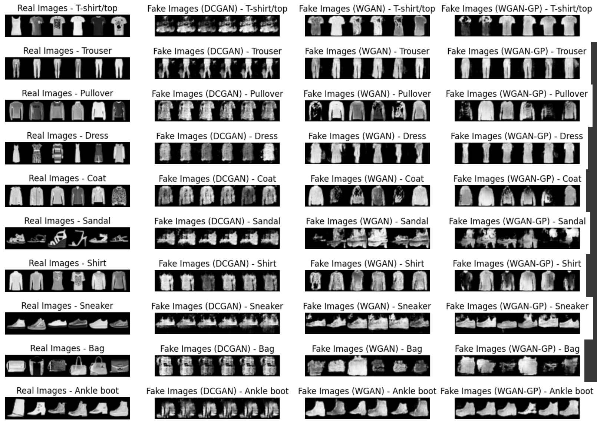

# DeepLearning

VAE training and SVM classification is based on "Semi-Supervised Learning with Deep Generative Models" by Kingma et al. (2014), [link to paper](https://arxiv.org/abs/1406.5298).

Wasserstein GAN with gradient clipping is based on "Improved Training of Wasserstein GANs" by Gulrajani et al. (2017), [link to paper](https://arxiv.org/abs/1704.00028).

## Prerequisites

- Python 3.10+
- PyTorch
- NumPy
- Matplotlib
- Fashion-MNIST data (locally or access)
- Google Colab (Optional: to run the script)

## VAE

These scripts implements and trains a VAE for feature extraction and an SVM for classification using the Fashion-MNIST dataset.

### Training & Testing

The function `run-experiment()` trains and tests our VAE model and the SVM classifier. It will also print out the final accuracies for the four different numbers of labels (100, 600, 1000, 3000). 

Example log:

```
Epoch 1 complete! 	Average Loss:  407.2164127604167
Epoch 2 complete! 	Average Loss:  323.04082421875
Epoch 3 complete! 	Average Loss:  304.61422330729164
Epoch 4 complete! 	Average Loss:  295.2882578125
Epoch 5 complete! 	Average Loss:  288.2894140625
Epoch 6 complete! 	Average Loss:  282.1976510416667
...
{100: 65.09, 600: 73.22, 1000: 75.71, 3000: 80.54}
```

Our models are all saved in the local `model` folder. Both the VAE model and the SVM model are saved after training.

To test our model, we created a function `test_model(size=3000)` where we feed in a random latent vector and generate an image using the decoder from our trained VAE model, then we use our trained SVM to predict the class. Size can be `100, 600, 1000, 3000`.


## GANs - DCGANs, WGANs, and WGAN-GPs

These scripts implement of GANS: DCGAN, WGAN (weight clipping), and WGAN-GP (gradient clipping) using the Fashion-MNIST dataset.

### Training

To train our GANs, we created a function `run(model_name, filter_size)` that specifies which of three methods we want to use, and the base filter size to use. Our two architectures differ in the base filter size, where one uses 32 and the other uses 64.

Example command:
```
G_WGAN_GP64, D_WGAN_GP64, G_losses_WGAN_GP64, D_losses_WGAN_GP64, img_list_WGAN_GP64 = run("WGAN-GP", 64)

[1/5][0/469]	Loss_G: 0.0330	Loss_C: -0.0531
[1/5][25/469]	Loss_G: 0.6247	Loss_C: -1.3128
[1/5][50/469]	Loss_G: 0.6250	Loss_C: -1.4137
[1/5][75/469]	Loss_G: 0.6084	Loss_C: -1.3106
[1/5][100/469]	Loss_G: 0.6898	Loss_C: -1.4923
[1/5][125/469]	Loss_G: 0.7156	Loss_C: -1.5165
...
```

Our models are all saved in the `model` folder. 

### Testing 

To test our models, we created a function `generate_images_from_trained_model(path, name, latent_size, filter_size, nc=1)` that uses a specified model to generate images. You can generate 6 images from each of the ten classes. 

Options for parameters:
- path: `YOUR_PATH_TO_MODEL` (path you saved your model to during training)
- name: `DCGAN, WGAN, WGAN_GP` 
- latent_size: `100`
- filter_size: `32, 64`

Example command:
```
generate_images_from_trained_model("/content/drive/MyDrive/Colab Notebooks/model/G_WGAN_GP64.pth", "WGAN-GP", 100, 64)
```

### Generated Images
